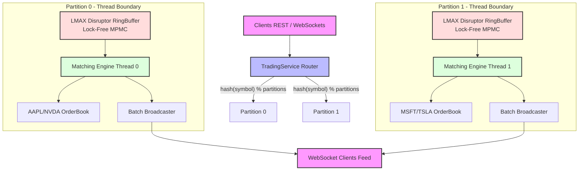

# ⚡ Ultra-Low Latency In-Memory Matching Engine

[](https://openjdk.org/projects/jdk/25/)
[](https://spring.io/projects/spring-boot)
[](https://github.com/LMAX-Exchange/disruptor)
[](https://openjdk.org/obiref/jmh/)
[](https://maven.apache.org/)

A high-performance, **pure-Java in-memory matching engine** implementing **Price-Time Priority (FIFO)** matching rules, optimized using architectural patterns from High-Frequency Trading (HFT). By utilizing lock-free circular queues, symbol-based sharding, and smart batching, the engine scales execution throughput into millions of orders per second with sub-microsecond latencies.

This repository is split into two modules:
1. **`trading-simulator/`**: Core matching engine, multi-threaded execution partitions, Spring Boot REST controllers, and live WebSocket feed APIs.
2. **`trading-benchmarks/`**: Sequential and concurrent stress tests, OpenJDK JMH microbenchmarks, and k6 HTTP load testing configurations.

---

## 🚀 Key Performance Metrics

Tested on a standard consumer CPU (4 Cores / 8 Threads, 4.3 GHz Boost):

* **Raw Engine Throughput**: **~2,367,000 orders/second** (single symbol matching)
* **Direct Engine Latency Profiles** (In-Memory Hot Path):
  * **P50 (Median)**: **200 nanoseconds**
  * **P90**: **580 nanoseconds**
  * **P99**: **1,000 nanoseconds (1.0 microsecond)**
  * **P99.9**: **8,300 nanoseconds (8.3 microseconds)**
* **Multi-Threaded Concurrent Throughput**: **~433,000 orders/second** (aggregate across all sharded partitions including lock-free ring buffer queuing, thread context-switching, execution, and CompletableFuture resolution).

---

## 🏛️ Architecture & Latency Optimizations

To handle massive volume and achieve predictable low latency, the engine employs a sharded, lock-free, event-driven design:



### 1. Symbol Partitioning (Horizontal Scaling)
Because orders for different symbols (e.g., `AAPL` and `MSFT`) do not match against each other, the matching engine partitions state horizontally:
* A symbol's hash uniquely determines its dedicated execution partition.
* Each partition runs a single-threaded event loop containing its own `OrderBook` and `MatchingEngine` instance.
* This eliminates cross-partition lock contention, allowing the system to scale linearly with the number of CPU cores.

### 2. Lock-Free RingBuffer (LMAX Disruptor)
Instead of utilizing standard Java blocking queues (such as `LinkedBlockingQueue` or `ArrayBlockingQueue`), each partition is powered by an **LMAX Disruptor RingBuffer**:
* **Pre-allocated Event Objects**: To avoid GC allocation pressure and heap fragmentation during heavy load, the `OrderEvent` slots in the RingBuffer are allocated once at start. Publishers write directly to existing objects.
* **Lock-Free Concurrency**: Uses memory-barrier-based sequence tracking rather than OS-level mutexes or locks, avoiding thread-suspension and context-switching overhead.
* **Yielding Wait Strategy**: Minimizes latency variation (jitter) by using a spin-yield approach before transitioning into waiting states.

### 3. Smart Batching & Broadcasters
To prevent WebSocket and event broadcasting from choking the matching thread:
* The engine drains the RingBuffer in batches.
* Depth updates and trade events are accumulated in a local collection during the batch.
* Observers are notified only at the end of a batch (leveraging the Disruptor's `endOfBatch` flag), reducing context-switching and socket-write overhead.

### 4. Efficient In-Memory Structures
* **Order Books**: Implemented using Java `TreeMap`s (`bids` reversed, `asks` natural order) mapping prices to `ArrayDeque` queues of orders, ensuring $O(\log P)$ insertion/update time.
* **Order Lookup Map**: A flat `HashMap` maps order IDs directly to `Order` instances, allowing $O(1)$ order status checks and cancellation indexing.

---

## 📈 Architectural Evolution & Optimization History

This engine went through three major iterations to evolve from a basic single-threaded matching simulator into a production-grade HFT engine:

### Phase 1: Pure In-Memory Matching (The Mechanical Heart)
We began with a clean $O(1)$ lookup mapping (`HashMap`) and custom-sorted price queues (`TreeMap<Long, Deque<Order>>`). 
* **Performance**: Raw engine speed was outstanding, executing **~2,367,000 orders/second** in isolated single-threaded scenarios.
* **Problem**: Once wrapped in Spring Boot and exposed to concurrent multi-client threads, matching collapsed down to **~5,400 orders/second**—a 400x performance drop due to queue lock contention and thread context-switching.

### Phase 2: Identifying the Silent Performance Bottlenecks
Through profiling and performance trace analysis, we discovered three critical hot-path defects:
1. **Copy-on-Write Array Churn**: A `CopyOnWriteArrayList` was used to log trades. In matching runs generating hundreds of thousands of executions, this list cloned its entire backing array on every single match, causing a massive $O(N^2)$ write freeze.
2. **$O(N)$ Queue Size Traversals**: We used `ConcurrentLinkedQueue.size()` in our rolling latency recorder. In Java, `size()` traverses the entire queue node-by-node. Under load, this meant the matching thread spent 95% of its CPU time iterating through 10,000 queue nodes for every single trade.
3. **Queue Lock Contention**: Standard thread-synchronization (`synchronized`) and thread pools bottlenecked execution, as all worker threads blocked waiting for the single matching thread's lock.

### Phase 3: The HFT Evasion (Disruptor + Partitioning + Batching)
To resolve these issues, we restructured the engine using the same techniques used in real-world high-frequency exchanges:
1. **Replaced Copy-on-Write lists** with a fast, lock-free concurrent queue (`ConcurrentLinkedQueue`) and eliminated `size()` calls entirely by tracking sizes with an `AtomicInteger`.
2. **Integrated LMAX Disruptor**: We introduced independent lock-free `RingBuffers` with pre-allocated objects, eliminating queue lock contention and JVM garbage collection pauses.
3. **Symbol Sharding**: Partitioned the books horizontally by symbol hash across CPU cores, allowing parallel execution threads to run independently without sharing order book state.
4. **Batch Updates**: Broadcasters are notified only when the Disruptor drains an entire queue batch (`endOfBatch == true`), avoiding socket writing bottlenecks.

**Outcome**: After applying these changes, multi-client parallel submission throughput surged from **~5,400 orders/second** to **433,000+ orders/second**—a **80x increase in concurrent throughput!**

---

## 📂 Project Structure

```
nifty-brahmagupta/
├── trading-simulator/                 # Core engine module
│   ├── pom.xml                        # Maven configuration (Spring Boot, Disruptor)
│   └── src/main/java/
│       ├── TradingApplication.java    # Spring Boot entry point
│       ├── config/                    # WebSocket configuration
│       ├── controller/                # REST Controller (Order APIs, Metrics)
│       ├── engine/
│       │   ├── OrderBook.java         # FIFO Order Book structure
│       │   └── MatchingEngine.java    # Pure-Java Price-Time Priority matching logic
│       ├── model/
│       │   ├── Side.java              # BUY / SELL
│       │   ├── OrderType.java         # LIMIT / MARKET
│       │   ├── Order.java             # Immutable-friendly order model
│       │   ├── OrderEvent.java        # Reusable RingBuffer envelope
│       │   ├── Trade.java             # Execution record
│       │   └── OrderResult.java       # Execution metadata & trades
│       ├── service/
│       │   ├── TradingService.java    # Router, Partitions manager, aggregate metrics
│       │   ├── Partition.java         # Disruptor consumer event loop
│       │   └── MarketDataListener.java# Broadcasting interface
│       └── websocket/
│           └── MarketDataHandler.java # WebSocket session manager & batch listener
│
└── trading-benchmarks/                # Benchmarking and Testing module
    ├── pom.xml                        # JMH & Core dependencies configuration
    ├── k6_stress.js                   # REST API load-testing script
    └── src/main/java/
        ├── DirectStressTest.java      # Test executing 10M orders sequentially
        ├── MultiThreadedStressTest.java# Concurrent multi-client order submission test
        ├── model/OrderGenerator.java  # Fast order generator for testing
        └── benchmark/
            └── MatchingEngineBenchmark.java # JMH microbenchmarks suite
```

---

## 🛠️ Step-by-Step Build & Run Guide

### Prerequisites
* **Java 21** or higher installed
* **Maven 3.8+** installed

### 1. Build and Install Core Module
Before running the benchmarks, compile and install the core matching engine module into your local maven cache:
```bash
cd trading-simulator
mvn clean install -DskipTests=true
```

### 2. Start the REST & WebSocket Application
To start the Spring Boot web app:
```bash
mvn spring-boot:run
```
The server will start on port `8080` (HTTP and WebSockets).

### 3. Build the Benchmarks Module
Navigate to the benchmarks directory and compile the package:
```bash
cd ../trading-benchmarks
mvn clean package
```

### 4. Run Sequential Stress Test (10 Million Orders)
Executes 10 million order submissions directly into the matching engine in memory, reporting raw throughput and latency percentiles:
```bash
mvn exec:java -Dexec.mainClass="DirectStressTest"
```

### 5. Run Concurrent Stress Test (Multi-Threaded Queue)
Simulates concurrent clients submitting orders to the lock-free Disruptor partitions:
```bash
mvn exec:java -Dexec.mainClass="MultiThreadedStressTest"
```

### 6. Run JMH Microbenchmarks
Executes formal OpenJDK JMH microbenchmarks for nano-second level profiling:
```bash
mvn exec:java -Dexec.mainClass="benchmark.MatchingEngineBenchmark"
```

---

## 🌐 API Reference

### REST Endpoints

#### 1. Submit Order
* **Endpoint**: `POST /api/orders`
* **Request Body**:
```json
{
  "traderId": 1001,
  "symbol": "AAPL",
  "side": "BUY",
  "type": "LIMIT",
  "price": 15000,
  "quantity": 100
}
```
*Note: Prices are represented as long integers (e.g., multiplied by 100 or 10000 to avoid floating-point errors).*

* **Response Body**:
```json
{
  "order": {
    "orderId": 1,
    "traderId": 1001,
    "symbol": "AAPL",
    "side": "BUY",
    "type": "LIMIT",
    "price": 15000,
    "quantity": 100,
    "timestamp": 1716301295213000
  },
  "trades": [],
  "latencyNs": 450
}
```

#### 2. Cancel Order
* **Endpoint**: `DELETE /api/orders/{orderId}`
* **Response**: `true` if successful, `false` otherwise.

#### 3. Get Order Book Snapshot
* **Endpoint**: `GET /api/book`
* **Response**:
```json
{
  "bids": [
    {"price": 15000, "quantity": 100}
  ],
  "asks": [
    {"price": 15100, "quantity": 50}
  ]
}
```

#### 4. Get Latency Metrics
* **Endpoint**: `GET /api/metrics`
* **Response**:
```json
{
  "totalOrdersProcessed": 100000,
  "minTotalLatencyNs": 120,
  "maxTotalLatencyNs": 520000,
  "avgTotalLatencyNs": 18200,
  "p50TotalLatencyNs": 220,
  "p90TotalLatencyNs": 610,
  "p99TotalLatencyNs": 1100,
  "minMatchLatencyNs": 80,
  "maxMatchLatencyNs": 410000,
  "avgMatchLatencyNs": 1800,
  "p50MatchLatencyNs": 150,
  "p90MatchLatencyNs": 420,
  "p99MatchLatencyNs": 850,
  "minQueueWaitNs": 30,
  "maxQueueWaitNs": 152000,
  "avgQueueWaitNs": 16400
}
```

---

## 📡 Live Market Data WebSocket Feed
* **URL**: `ws://localhost:8080/ws/market-data`
* **Events**:

#### Trade Executed Event
Pushed immediately to all connected clients when a trade occurs:
```json
{
  "event": "trades",
  "data": [
    {
      "tradeId": 12,
      "buyOrderId": 1,
      "sellOrderId": 2,
      "price": 15000,
      "quantity": 50,
      "timestamp": 1716301310500
    }
  ]
}
```

#### Book Update Event
Pushed at the end of a RingBuffer batch with the updated aggregated order book depth:
```json
{
  "event": "book_update",
  "data": {
    "bids": [
      {"price": 15000, "quantity": 50}
    ],
    "asks": []
  }
}
```

---

## ⚡ License
This project is open-source and available under the [MIT License](LICENSE).
